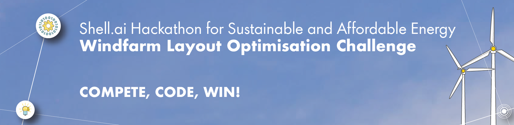
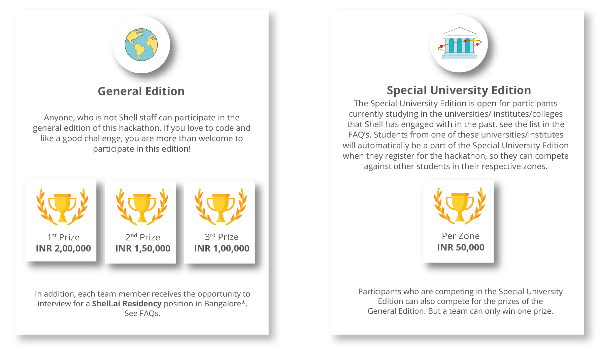
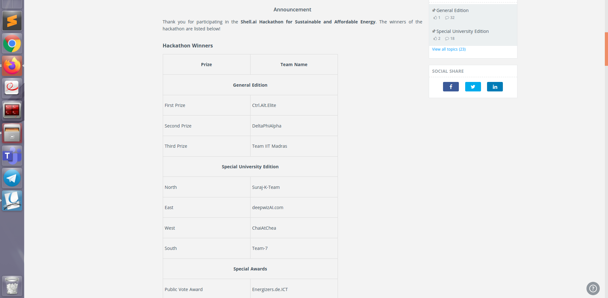
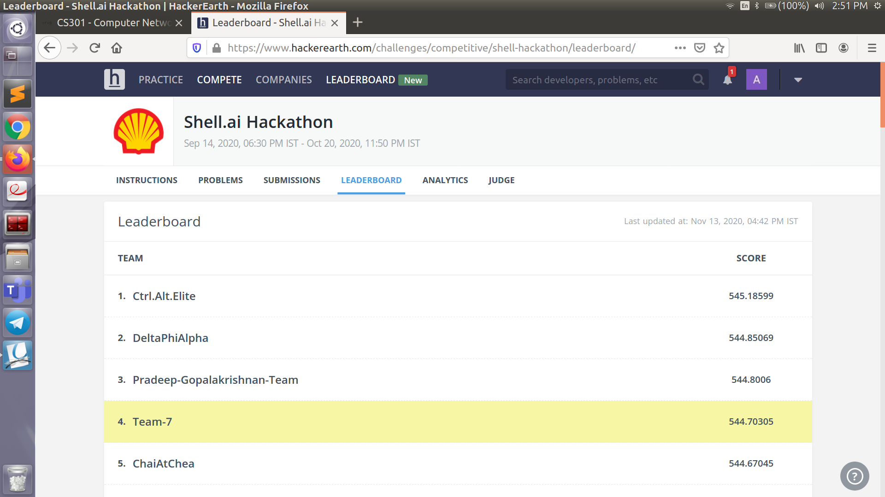

 

  
  

  
<H1> Shell.ai Hackathon Windfarm Layout Optimisation (WFLO) Challenge </H1>

# TEAM MEMBERS 
<ul>
<li> <b><i> Awanit Ranjan (Team Leader) </i></b> </li>
<li><b><i> Akash Hemantrao Waitage  </i></b></li>
<li><b><i> Abhsihek Choudhary  </i></b></li>
<li> <b><i> Vivek Kumar </i></b></li>
</ul>

  
<hl>

 
 
 
 

 

I am glad to state that our Team named as <b> TEAM-7 </b> won the fourth position on Leader Board and First Position under <b >Special University Edition(SPE) </b> from <b> South Zone </b> with the <b>score of 544.70305 </b>.

 <I>Here is the list of Teams Won</I>
   

  
 

  <B>LEADERBOARD</B>
  
 

 
 
  
    
 

 The Approach/Algorithm which we used for solving WFLOP is in Folder named as Approach. :)) 

  

+ If you are excited to see the videos of our work check the links below : 

   + <b>Pitch Video </b>: https://youtu.be/_ahxVd1lSmY
 
  

